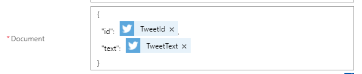

# Advanced Analytics Lab

## Introduction

This lab is to help explore Cosmos DB and how it can be tied into a scenario ingesting a stream of data and surfacing that up via Azure Search.

This assumes you have a Cosmos DB Instance up and running.

## Collecting the data

We are going to be collecting tweets based on a keyword and pushing those to Cosmos DB on a 1 minute schedule. To do this we'll leverage logic apps.

1. In the Azure Portal go to create and search for Logic Apps.
2. Enter the details to deploy the logic app - ideally choosing the same region as your Cosmos DB instance.
3. Once the logic app has been created, navigate to it and open the designer.

4. Within the designer, scroll down and choose the Blank App option

5. Seach for the schedule connector and choose that.
6. Set the interval to 1 minute.

7. Choose *new step* and then *add an action*
8. Search for Cosmos and choose the *Query documents* option.

9. Enter this as the query:
        SELECT top 1 * FROM c ORDER BY c._ts DESC
10. Choose *new step* and, expand the *more* option and choose *for each loop*

11. Select **Documents** as the output.
12. Now choose *add an action* within the for each module.
13. Search for *twitter* and scroll down for the *Search tweets* option and choose that.

12. Enter a search term - anything you like though ideally something that returns a lot of tweets (e.g. Microsoft or Azure)
13. Expand advanced options and in *sinceid* select *Current Item*
14. Add a new action and search for Cosmos. Choose the *Create or update a document* option
15. Enter the following as the document to create:

16. Save your logic app and then press **Run** to try it out.

## Populating Azure Search

1. In the Azure Portal create an Azure Search instance. The free tier is fine for this.
2. Once it is created, navigate to it and choose *import data*

3. From the data source navigate to your Cosmos Db Instance
4. Enter this as the query
>SELECT * FROM c WHERE c._ts >= @HighWaterMark ORDER BY c._ts
5. Mark the text field as *retrievable* and *searchable*

6. Set up schedule to run every 10minutes.

## Setup front end application

1. Within this repo there is a simple HTML page (under the search-app folder). Run this locally in your browser. It will ask you for three items - Azure Search Name, Search Key and Index Name. You can get these from your Azure Search instance in the portal. 
2. Once you have entered these, you should be able to search across all your collected tweets using the search box.

## Lab
[Demo Preview](search-app/search.htm)