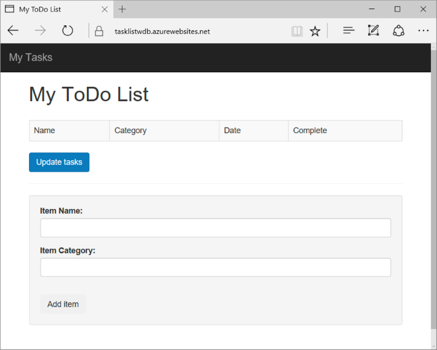
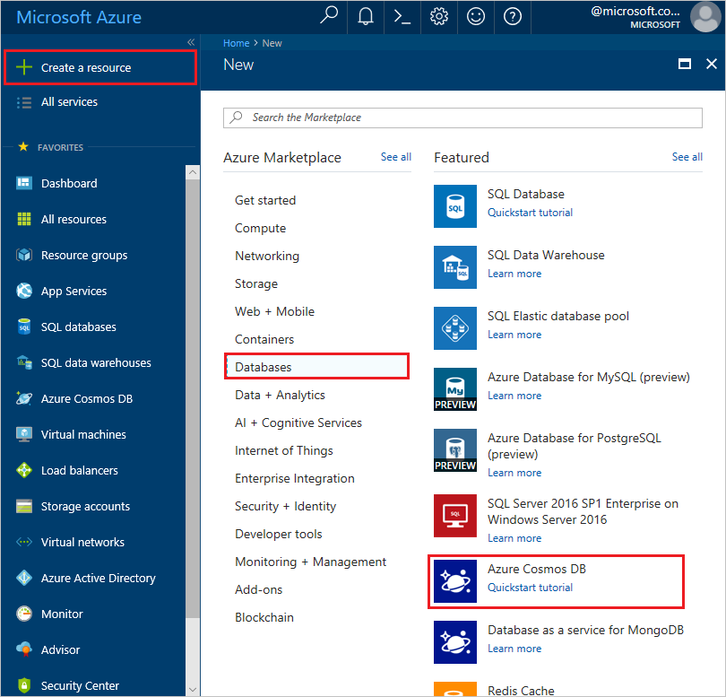
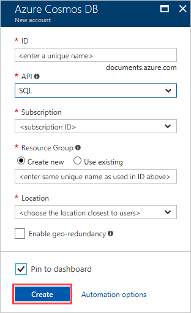
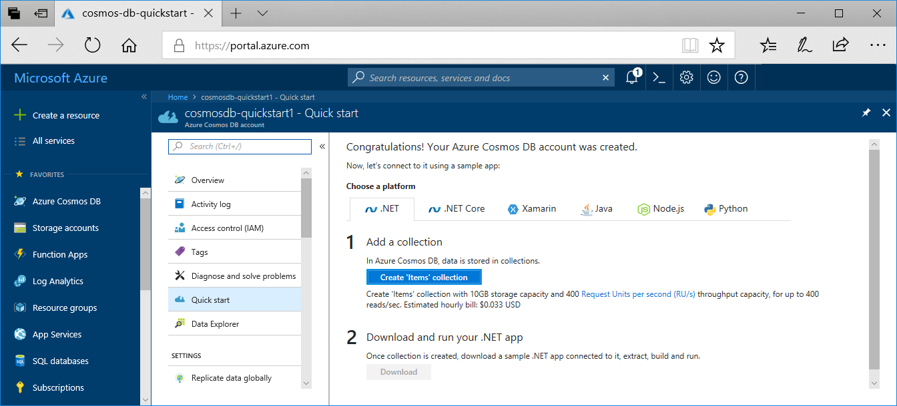
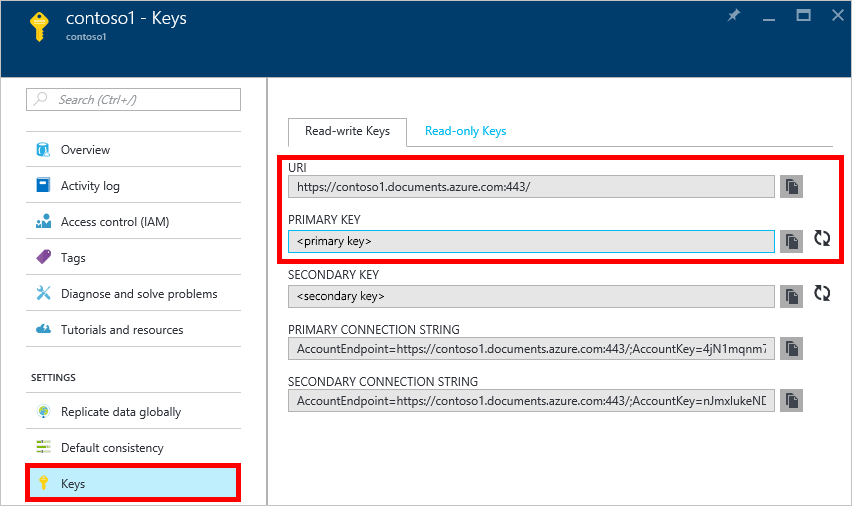
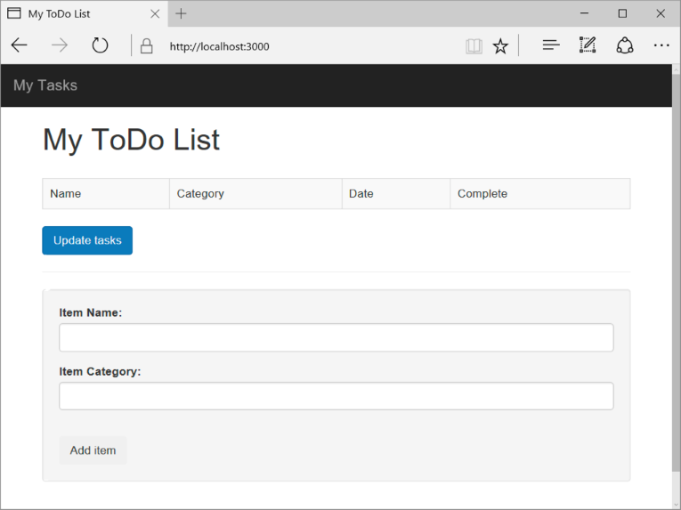
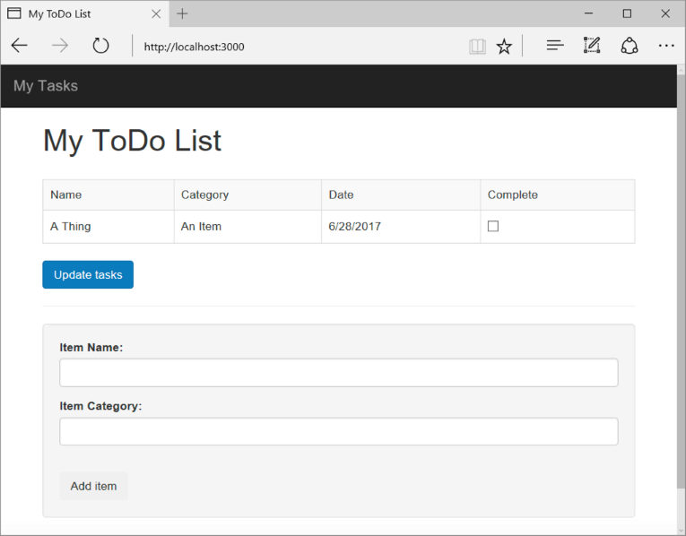

# Cosmos DB Application Lab

This Node.js tutorial shows you how to use Azure Cosmos DB and the SQL API to store and access data from a Node.js Express application hosted on Azure Websites. You build a simple web-based task-management application, a ToDo app, that allows creating, retrieving, and completing tasks. The tasks are stored as JSON documents in Azure Cosmos DB. This tutorial walks you through the creation and deployment of the app and explains what's happening in each snippet.



Don't have time to complete the tutorial and just want to get the complete solution? Not a problem, you can get the complete sample solution from [GitHub][GitHub]. Just read the [Readme](https://github.com/Azure-Samples/documentdb-node-todo-app/blob/master/README.md) file for instructions on how to run the app.

## Prerequisites
Before following the instructions in this article, you should ensure
that you have the following:

* If you don't have an Azure subscription, create a [free account](https://azure.microsoft.com/free) before you begin. 
* [Node.js][Node.js] - We recommend Node.js 6.10 or higher.
* [Git][Git]

## Step 1: Create an Azure Cosmos DB database account
Let's start by creating an Azure Cosmos DB account. 

1. In a new browser window, sign in to the [Azure portal](https://portal.azure.com/).
2. Click **Create a resource** > **Databases** > **Azure Cosmos DB**.
   
   

3. In the **New account** page, enter the settings for the new Azure Cosmos DB account. 
 
    Setting|Value|Description
    ---|---|---
    ID|*Enter a unique name*|Enter a unique name to identify this Azure Cosmos DB account. Because *documents.azure.com* is appended to the ID that you provide to create your URI, use a unique but identifiable ID.<br><br>The ID can contain only lowercase letters, numbers, and the hyphen (-) character, and it must contain 3 to 50 characters.
    API|SQL|The API determines the type of account to create. Azure Cosmos DB provides five APIs to suits the needs of your application: SQL (document database), Gremlin (graph database), MongoDB (document database), Azure Table, and Cassandra, each which currently require a separate account. <br><br>Select **SQL** because in this quickstart you are creating a document database that is queryable using SQL syntax and accessible with the SQL API.<br><br>[Learn more about the SQL API](../articles/cosmos-db/documentdb-introduction.md)|
    Subscription|*Your subscription*|Select Azure subscription that you want to use for this Azure Cosmos DB account. 
    Resource Group|Create new<br><br>*Then enter the same unique name as provided above in ID*|Select **Create New**, then enter a new resource-group name for your account. For simplicity, you can use the same name as your ID. 
    Location|*Select the region closest to your users*|Select geographic location in which to host your Azure Cosmos DB account. Use the location that's closest to your users to give them the fastest access to the data.
    Enable geo-redundancy| Leave blank | This creates a replicated version of your database in a second (paired) region. Leave this blank.  
    Pin to dashboard | Select | Select this box so that your new database account is added to your portal dashboard for easy access.

    Then click **Create**.

    

4. The account creation takes a few minutes. Wait for the portal to display the **Congratulations! Your Azure Cosmos DB account was created** page.

    

  Now navigate to the Azure Cosmos DB account page, and click **Keys**, as these values are used in the web application you create next.




## Step 2: Download NodeJS Cosmos DB Framework app
1. Clone this repository and in a terminal navigate to the ToDo app.
2. Run `npm install`

## Step 3: Install additional modules
The **package.json** file is one of the files created in the root of the project. This file contains a list of additional modules that are required for your Node.js application. Later, when you deploy this application to Azure Websites, this file is used to determine which modules need to be installed on Azure to support your application. We still need to install two more packages for this tutorial.

* Install the **documentdb** module via npm. This is the module where all the Azure Cosmos DB magic happens.
   
        npm install documentdb --save

## Step 4: Using the Azure Cosmos DB service in a node application
That takes care of all the initial setup and configuration, now let’s get down to why we’re here, and that’s to write some code using Azure Cosmos DB.

### Create the database manager
1. In **modules/cosmosdb-manager.js** add a reference to the cosmos db node package by replacing `<require package>` with `require('documentdb').DocumentClient;`

2. Under the `getOrCreateDatabase` add in the query to get a list of databases by replacing `<database list query>`:

    ```nodejs
    {
        query: 'SELECT * FROM root r WHERE r.id = @id',
        parameters: [{ name: '@id', value: databaseId }]
    };

3. Add a create database statement by replacing `<create a database>`.

    ```nodejs
    client.createDatabase(databaseSpec, (err, created) => {
                callback(null, created);
            });

4. Under the `getOrCreateCollection` add in the query to get a list of collections by replacing `<collection check query>`:

    ```nodejs
    {
        query: 'SELECT * FROM root r WHERE r.id=@id',
        parameters: [{ name: '@id', value: collectionId }]
    };

5. Add a create collection statement by replacing `<create a collection>`:

    ```nodejs
    client.createCollection(databaseLink, collectionSpec, (err, created) => {
        callback(null, created);
    });

6. Save and close the **cosmosdb-manager.js** file.

### Create model

1. In **models/task-model.js** initialize the database objects in the `init` function by replacing `<initialize database objects>`:

    ```nodejs
    docdbUtils.getOrCreateDatabase(self.client, self.databaseId, function(err, db) {
        if (err) {
            callback(err);
        } else {
            self.database = db;
            docdbUtils.getOrCreateCollection(self.client, self.database._self, self.collectionId, function(err, coll) {
            if (err) {
                callback(err);
            } else {
                self.collection = coll;
            }
            });
        }
    });    
    ```

2. Add code for querying cosmos db by replacing `<find data in database>`:

    ```nodejs
    self.client.queryDocuments(self.collection._self, querySpec).toArray(function(err, results) {
        if (err) {
            callback(err);
        } else {
            callback(null, results);
        }
    });
    ```

3. Add code for creating a document by replacing `<create a document in cosmosdb>`:

    ```nodejs
    item.date = Date.now();
    item.completed = false;

    self.client.createDocument(self.collection._self, item, function(err, doc) {
        if (err) {
            callback(err);
        } else {
            callback(null, doc);
        }
    });
    ```

4. Add code to update a document by replacing `<update an existing item in cosmosdb>`:

    ```nodejs
    self.getItem(itemId, function(err, doc) {
        if (err) {
            callback(err);
        } else {
            doc.completed = true;

            self.client.replaceDocument(doc._self, doc, function(err, replaced) {
                if (err) {
                    callback(err);
                } else {
                    callback(null, replaced);
                }
            });
        }
    });
    ```

5. Add code to get a specific item from cosmos db by replacing `<get a specific item>`:

    ```nodejs
    let querySpec = {
        query: 'SELECT * FROM root r WHERE r.id = @id',
        parameters: [{ name: '@id', value: itemId }]
    };

    self.client.queryDocuments(self.collection._self, querySpec).toArray(function(err, results) {
        if (err) {
            callback(err);
        } else {
            callback(null, results[0]);
        }
    });
    ```

6. Save and close the **task-model.js** file. 

### Create the controller
1. In **routes/tasklist.js** add code to get list of tasks from Cosmos DB by replacing `<get tasks to show on UI>`:

    ```nodejs
    let querySpec = {
        query: 'SELECT * FROM root r WHERE r.completed=@completed',
        parameters: [
            {
                name: '@completed',
                value: false
            }
        ]
    };

    self.taskModel.find(querySpec, function(err, items) {
        if (err) {
            throw err;
        }

        res.render('index', {
            title: 'My ToDo List ',
            tasks: items
        });
    });
    ```

2. Add code to create a task object and insert it by replacing `<add a task to database>`:
    ```nodejs
    let item = req.body;

    self.taskModel.addItem(item, function(err) {
        if (err) {
            throw err;
        }

        res.redirect('/');
    });
    ```

3. Add some code to update a task's status by replacing `<update status of task>`:

    ```nodejs
    let completedTasks = Object.keys(req.body);

    async.forEach(
        completedTasks,
        function taskIterator(completedTask, callback) {
            self.taskModel.updateItem(completedTask, function(err) {
            if (err) {
                callback(err);
            } else {
                callback(null);
            }
            });
        },
        function goHome(err) {
            if (err) {
                throw err;
            } else {
                res.redirect('/');
            }
        }
    );
    ```

4. Save and close the **tasklist.js** file.

### Update the config.js
1. In the **config.js** file, update the values of HOST and AUTH_KEY using the values found in the Keys page of your Azure Cosmos DB account on the [Microsoft Azure portal](https://portal.azure.com).
2. Save and close the **config.js** file.

### Modify app.js
1. In the project directory, open the **app.js** file. 

2. Add the following code to the top of **app.js**:
   
    ```nodejs
    var DocumentDBClient = require('documentdb').DocumentClient;
    var config = require('./config');
    var TaskList = require('./routes/tasklist');
    var TaskModel = require('./models/task-model');
    ```
3. This code defines the config file to be used, and proceeds to read values out of this file into some variables we will use soon.
4. Replace the following two lines in **app.js** file:
   
    ```nodejs
    app.use('/', index);
    app.use('/users', users); 
    ```
   
    with the following snippet:
   
    ```nodejs
    let docDbClient = new DocumentDBClient(config.host, {
        masterKey: config.authKey
    });
    let taskModel = new TaskModel(docDbClient, config.databaseId, config.collectionId);
    let taskList = new TaskList(taskModel);
    taskModel.init();
   
    app.get('/', taskList.showTasks.bind(taskList));
    app.post('/addtask', taskList.addTask.bind(taskList));
    app.post('/completetask', taskList.completeTask.bind(taskList));
    app.set('view engine', 'jade');
    ```
5. These lines define a new instance of our **TaskModel** object, with a new connection to Azure Cosmos DB (using the values read from the **config.js**), initialize the task object and then bind form actions to methods on our **TaskList** controller. 
6. Finally, save and close the **app.js** file, we're just about done.

## Step 5: Build a user interface
Now let’s turn our attention to building the user interface so a user can actually interact with our application. The Express application we created uses **Jade** as the view engine. For more information on Jade please refer to [http://jade-lang.com/](http://jade-lang.com/).

1. The **layout.jade** file in the **views** directory is used as a global template for other **.jade** files. In this step you will modify it to use [Twitter Bootstrap](https://github.com/twbs/bootstrap), which is a toolkit that makes it easy to design a nice looking website. 
3. Now open the **views/index.jade** file, the view that will be used by our application, and replace the content of the file with the following:

    ```nodejs
    extends layout
    block content
        h1 #{title}
        br
    
        form(action="/completetask", method="post")
            table.table.table-striped.table-bordered
                tr
                    td Name
                    td Category
                    td Date
                    td Complete
                if (typeof tasks === "undefined")
                    tr
                        td
                else
                    each task in tasks
                        tr
                            td #{task.name}
                            td #{task.category}
                            - var date  = new Date(task.date);
                            - var day   = date.getDate();
                            - var month = date.getMonth() + 1;
                            - var year  = date.getFullYear();
                            td #{month + "/" + day + "/" + year}
                            td
                                input(type="checkbox", name="#{task.id}", value="#{!task.completed}", checked=task.completed)
            button.btn.btn-primary(type="submit") Update tasks
        hr
        form.well(action="/addtask", method="post")
            .form-group
                label(for="name") Item Name:
                input.form-control(name="name", type="textbox")
            .form-group
                label(for="category") Item Category:
                input.form-control(name="category", type="textbox")
            br
            button.btn(type="submit") Add item
    ```

This extends layout, and provides content for the **content** placeholder we saw in the **layout.jade** file earlier.
   
In this layout we created two HTML forms.

The first form contains a table for our data and a button that allows us to update items by posting to **/completetask** method of our controller.
    
The second form contains two input fields and a button that allows us to create a new item by posting to **/addtask** method of our controller.

This should be all that we need for our application to work.

## Step 6: Run your application locally
1. To test the application on your local machine, run `npm start` in the terminal to start your application, then refresh your [http://localhost:3000](http://localhost:3000) browser page. The page should now look like the image below:
   
    

    > [!TIP]
    > If you receive an error about the indent in the layout.jade file or the index.jade file, ensure that the first two lines in both files is left justified, with no spaces. If there are spaces before the first two lines, remove them, save both files, then refresh your browser window. 

2. Use the Item, Item Name and Category fields to enter a new task and then click **Add Item**. This creates a document in Azure Cosmos DB with those properties. 
3. The page should update to display the newly created item in the ToDo
   list.
   
    
4. To complete a task, simply check the checkbox in the Complete column,
   and then click **Update tasks**. This updates the document you already created and removes it from the view.

5. To stop the application, press CTRL+C in the terminal window and then click **Y** to terminate the batch job.

## Step 7: Add Artificial Intelligence to the Application

Let's add some intelligence to the app to allow you to upload photos of handwritten tasks. To do this we will use the Azure Cognitive Service for handwriting recognition.

### Create Cognitive Service
1. Go to the Azure Portal and choose New.
2. Search for *Computer Vision API* and create this service.

### Update App to use this service
1. Add the following to the bottom of the **index.jade** file to create the upload form:

    ```nodejs
        form(method="post", enctype="multipart\/form-data", action="/handwritingtask")
        input(type="hidden", name="sid", value=sessionId)

        p Image:
            input(type="file", name="image")
        p
            input(type="submit", value="upload")
    ```

2. Open **tasklist.js** under routes and add the following task:

    ```nodejs
    ,

handwritingTask: function (req, res) {
    let self = this;
    var fstream;
    var apikey = "<api-key>";
    req.pipe(req.busboy);
    req.busboy.on('file', function (fieldname, file, filename) {
        console.log("Uploading: " + filename);
        
        //Path where image will be uploaded
        fstream = fs.createWriteStream('public/' + filename);
        file.pipe(fstream);
        fstream.on('close', function () {
            fs.readFile('public/' + filename, function (err, data) {
                if (err)
                    console.log("read jpg fail " + err);
                else {
                    var post_options = {
                        url: 'https://westus.api.cognitive.microsoft.com/vision/v1.0/recognizeText?handwriting=true',
                        qs: {
                            "detectOrientation ": "true",
                            language: 'en'
                        },
                        headers: {
                            'Content-Type': 'application/octet-stream',
                            'Ocp-Apim-Subscription-Key': apikey,
                            'Content-Length': data.length
                        },
                        body: data
                    };

                    request.post(post_options, function (error, response, body) {
                        console.log(body);

                        operationLocation = response.headers['operation-location'];
                        var options = {
                            url: operationLocation,
                            method: 'GET',
                            headers: {
                                'Ocp-Apim-Subscription-Key': apikey,
                            }
                        };
                        console.log(operationLocation);
                        sleep(5000);
                        request.get(options, function (error, response, body) {
                            console.log(body);
                            var responseJson = JSON.parse(body);
                            for (var line in responseJson.recognitionResult.lines) {
                                console.log(responseJson.recognitionResult.lines[line].text);
                                var item = {};
                                item.name = responseJson.recognitionResult.lines[line].text;
                                item.category = 'mobile';
                                self.taskModel.addItem(item, function (err) {
                                    if (err) {
                                        throw err;
                                    }

                                });
                            }
                            res.redirect('/');
                        });

                        
                    });
                }
                console.log("Upload Finished of " + filename);
            });
        });
    });
}
    ```
3. Update the `<vision api key>` in the above with your cognitive service key.
4. Add the following to app.js:
    ```nodejs
    app.post('/handwritingtask', taskList.handwritingTask);
    ```
5. Test the application on your local machine, run `npm start` in the terminal to start your application, then refresh your [http://localhost:3000](http://localhost:3000) browser page. 


[Node.js]: http://nodejs.org/
[Git]: http://git-scm.com/
[GitHub]: https://github.com/Azure-Samples/documentdb-node-todo-app